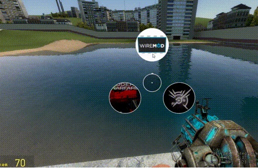
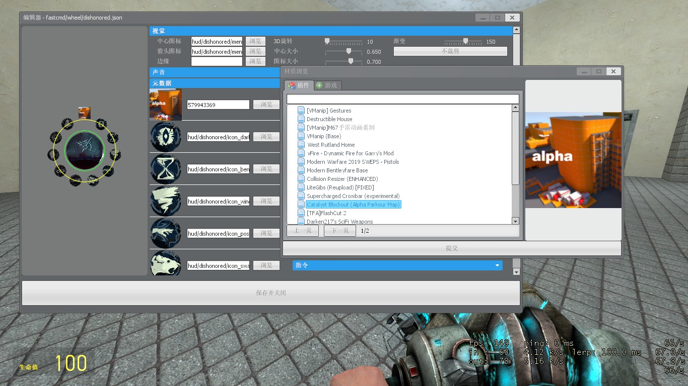

# Gmod 快速指令插件文档

## 插件概述
轮盘式指令菜单插件，支持自定义外观配置，通过JSON配置文件定义菜单样式与指令行为。

## 核心数据结构（wfile.json）

### 1. wheeldata（根配置）
| 字段名 | 类型 | 必要性 | 描述 |
|--------|------|--------|------|
| fade | number | 可选 | 菜单渐变程度 |
| cicon | string | 可选 | 中心图标路径 |
| arrow | string | 可选 | 箭头图标路径 |
| edge | string | 可选 | 边缘图片路径 |
| iconsize | number | 可选 | 图标大小（占菜单周长的比例） |
| centersize | number | 可选 | 中心图标大小（占菜单周长的比例） |
| autoclip | boolean | 可选 | 是否启用自动裁剪 |
| metadata | array | 必要 | 样式与指令数据集合（详见2.metadata） |

### 2. metadata（子项配置）
| 字段名 | 类型 | 必要性 | 描述 |
|--------|------|--------|------|
| call | dict | 必要 | 指令执行配置（详见3.call） |
| icon | string | 可选 | 当前子项的图标路径 |

### 3. call（指令执行配置）
| 字段名 | 类型 | 必要性 | 描述 |
|--------|------|--------|------|
| pexecute | string | 必要 | 按下call键时执行的指令 |
| rexecute | string | 可选 | 松开call键时执行的指令（未配置则自动解析pexecute） |
| bexecute | string | 可选 | 按下中断键时执行的指令（未配置则自动解析pexecute） |
| sexecute | string | 可选 | 轮盘菜单选择后执行的指令 |

## 可用Hook接口

| Hook名称 | 参数 | 描述 |
|----------|------|------|
| FcmdmExecuteBreak | curcall（当前call数据）、cmdfilter（指令过滤器） | 执行中断时触发 |
| FcmdmCurCallChange | old（旧call数据）、new（新call数据） | 当前call数据变更时触发 |
| FcmdmCurWDataChange | old（旧wheeldata数据）、new（新wheeldata数据） | 当前wheeldata数据变更时触发 |
| FcmdmExpandWheel | state（展开状态） | 轮盘展开/收起状态变更时触发 |
| FcmdmWheelSelectChange | curwdata（当前wheeldata）、idx（选中项索引）、metadata（选中项metadata） | 轮盘选中项变更时触发 |
| FcmdmExecuteCall | curcall（当前call数据）、state（状态：按下/松开）、cmdfilter（指令过滤器） | 执行call指令时触发 |
| FcmdmPreDrawWheel2D | size（菜单大小）、curwdata（当前wheeldata）、state（插值程度0-1） | 2D绘制轮盘前触发 |
